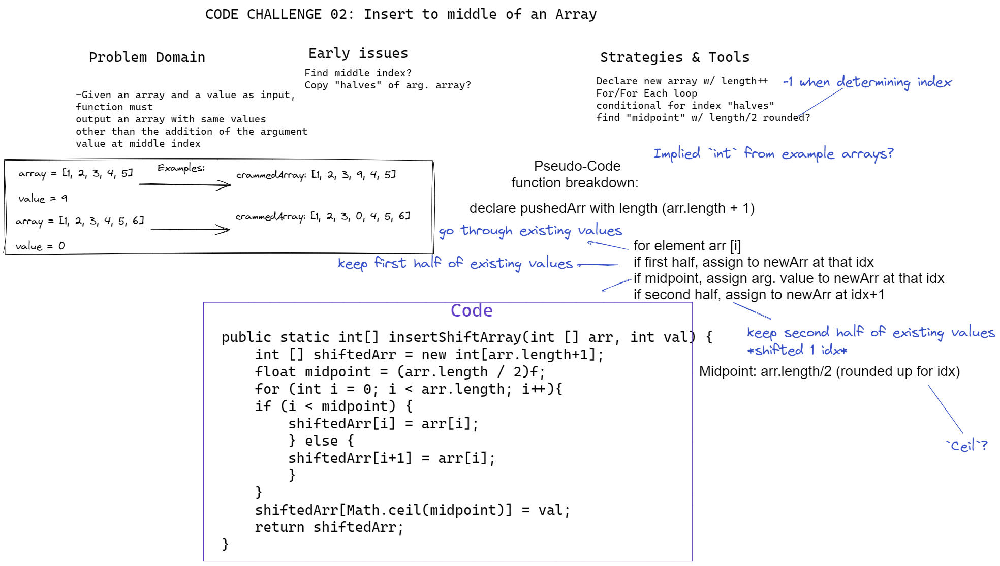

# Challenge 02 Whiteboard: Insert to Middle of an Array

Desired function "insertShiftArray" must:

Take in an array and a value as input; return an array with the argument value added in at the middle index.

## Whiteboard Process

## Approach & Efficiency

I opted to determine the "middle" index by halving the array length, then iterating through a `for` loop with conditionals for each array element to check which "half" of the array each was in. The first half would be assigned to the equivalent index of the returned array, while the second half would be assigned at an incremented index. Rounding up the midpoint value should give an index for the argument value to be assigned to in the returned array.
This approach requires creation of a new array of size `n`.
(I'm not sure if full or partial duplication of the original array allows for better efficiency. Would `break`-ing into a new code block after midpoint is reached be more efficient than checking condition in loop?).
