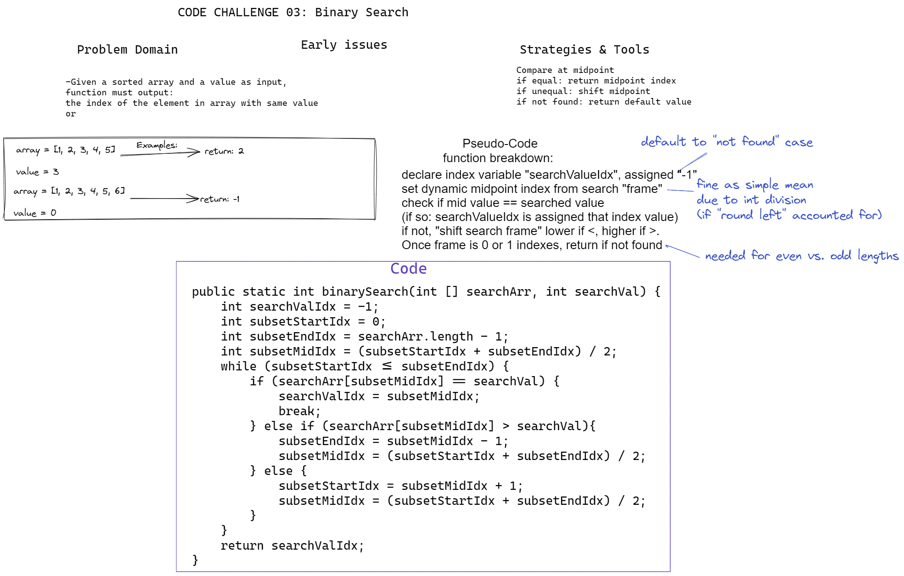

# Challenge 03 Whiteboard: Binary Search in Sorted 1d Array

Desired function "BinarySearch" must:

Take in an array and a value as arguments; return the index within the array of an element equal to the value or "-1" if not present.

## Whiteboard Process

## Approach & Efficiency

My approach relies on setting a search "frame" of array indexes with a single value comparison at a time at the average index (rounded down via integer division), then adjusting the frame based on the comparison (or returning the index value if equal). The final case is reached when the search "frame" is one index "wide"-- if the value is not equal, the default of -1 will be returned.

"O" of log n -- although on further reflection, I may have been able to trim some assignments and move some code between loops/conditionals to gain efficiency.
