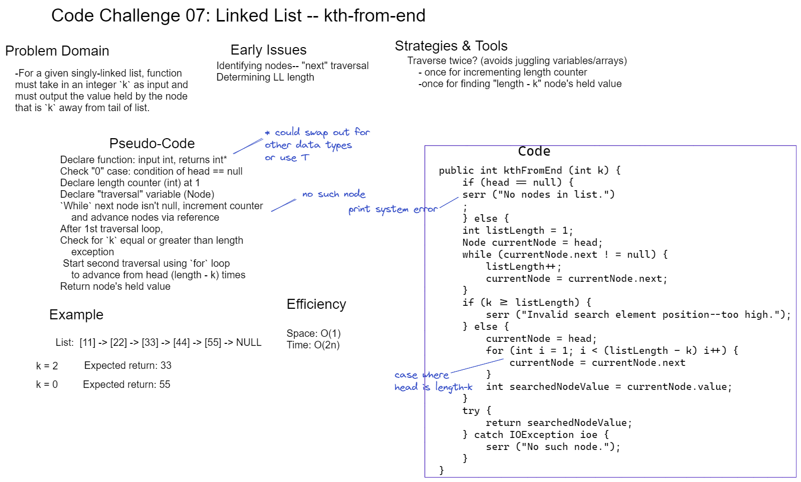

# Challenge 07 Whiteboard: "k-th" From End of Linked List

Desired function `kthFromEnd` must:

Return value of element in node that is `k` nodes from tail of a singly-linked List.

## Whiteboard Process

## Approach & Efficiency

My solution requires traversing once (via a node variable assigned to sequential referenced nodes) to define the length of the list, then a second time by a number of nodes defined by the length and the input value.

* Space efficiency: O(1). The few variables used do not scale with size of input.

* Time efficiency: O(2n). The list must potentially be traversed twice with my method.
