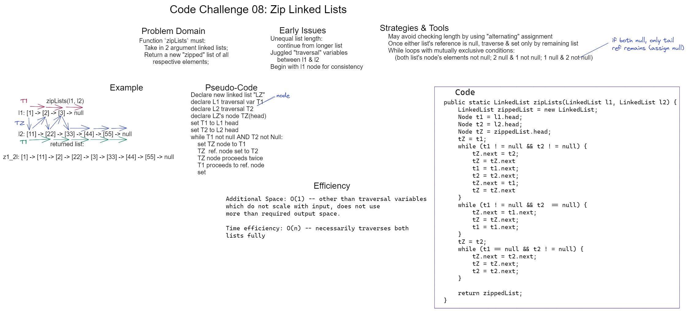

# Challenge 08 Whiteboard: Zipped Lists

Desired function `zipLists` must:

Take in two LinkedLists, then return a new list consisting of alternating nodes from the argument lists.

## Whiteboard Process

## Approach & Efficiency

My solution makes use of two "traversal" variables for each argument Linked List as well as one for the newly built list that assigns new nodes to existing node values. Assignments alternate within the main while loop until either list is exhausted (checked with null element values), in which case the remaining list portion is fully assigned.

* Space efficiency: O(1). Other than the traversal variables which do not scale with input, does not use more space than is necessary for the required return.

* Time efficiency: O(n). By necessity, both argument lists are iterated through, and the "builder" node is reassigned.
