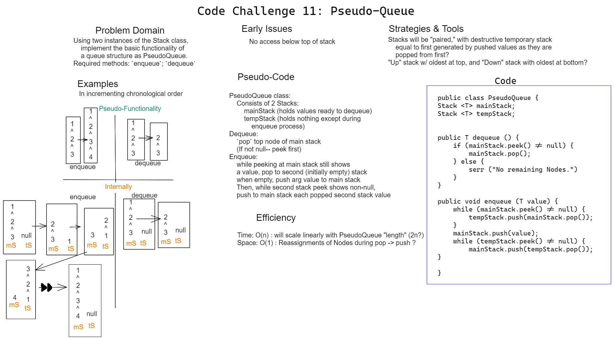

# Challenge 11 Whiteboard: PseudoQueue

Desired function class PseudoQueue must:

Consist of two Stacks and implement basic Qeueue functionality.
Required methods:
* `enqueue`
* `dequeue`

## Whiteboard Process

## Approach & Efficiency

My solution makes use of one component Stack "mainStack" that holds all values in ascending chronological order-- that is, the top value is the first one that was pushed to the stack.
"mainStack" is then ready for dequeue-ing by means of the `pop` method.
Enqueue-ing is done by way of the second (usually empty) stack "tempStack", which during `enqueue` calls is *pop*ulated by pushing in the popped values from the mainStack. The argument value is then pushed into mainStack, followed by each tempStack Node's held values, resulting in correct chronological order.

* Enqueue Efficiency
  * Space efficiency: O(1). Additional space is limited to temporary assignments during `pop` and `push`

  * Time efficiency: O(n). All existing mainStack values must be *pop*ulated twice, so time will scale with PseudoQueue size.

* Dequeue Efficiency
  * Space efficiency: O(1). Independent of PseudoQueue size.

  * Time efficiency: O(1). Independent of PseudoQueue size.
