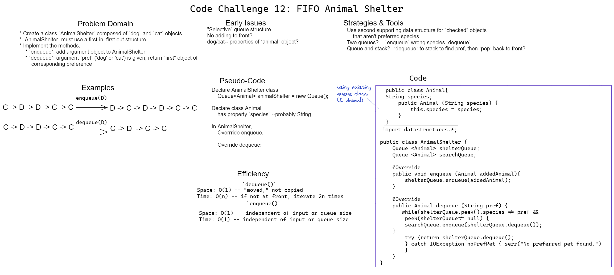

# Challenge 12 Whiteboard: FIFO Animal Shelter

Desired class `AnimalShelter` must:

Consist of a data structure that uses the following two methods:
* `enqueue`: adds an Animal object (Cat or Dog) to structure
* `dequeue`: takes a preferred species argument and returns (destructively) the first instance of that species

## Whiteboard Process

## Approach & Efficiency

My approach
