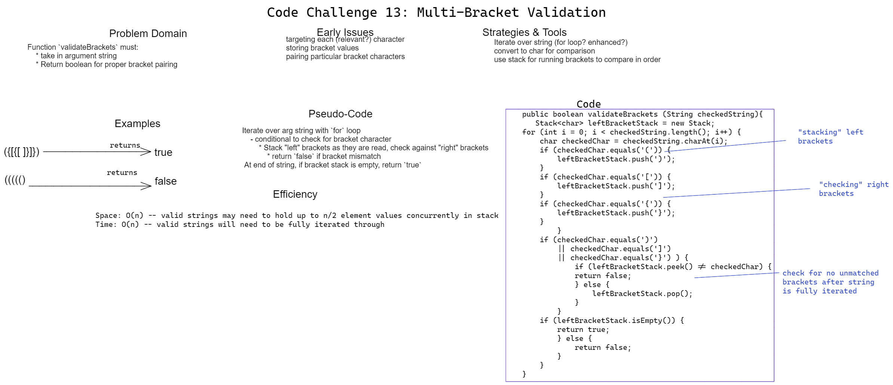

# Challenge 13 Whiteboard: PseudoQueue

Desired function `validateBrackets` must:

* Take a string as an argument
* Return a boolean indicating if the opening bracket characters `(`,`[`, or `{` in the string each have a respective closing bracket `)`,`]`,or `}`.

## Whiteboard Process

## Approach & Efficiency

My approach first declares a stack, then iterates through each character in the string-- if an "opening bracket" character is identified, a node with the corresponding closing bracket character as held value is pushed into a stack. Closing bracket characters are compared to top value, which is popped if equal. Only if the stack is empty after full iteration is `true` returned.

  * Space efficiency: O(n). Valid strings will lead to up to half the input characters held as element values in the stack concurrently.

  * Time efficiency: O(n). Valid strings will have to be fully iterated through.
