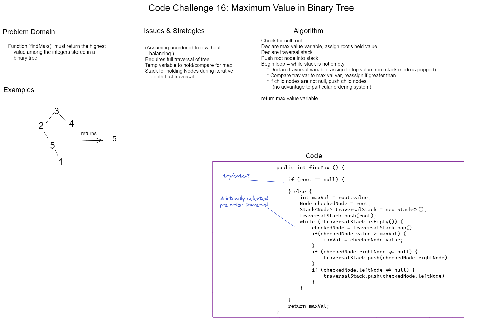

# Challenge 16 Whiteboard: Find Max in Binary Tree

Desired function `findMax()` must:

* Return the highest integer value held by the nodes of a binary tree

## Whiteboard Process

## Approach & Efficiency

My approach is an iterative traversal of the tree. This requires a traversal variable that will be assigned the value of each Node eventually as well as a stack to hold Nodes as they are traversed and a variable for comparing and returning the highest held value.

* Space efficiency: O(n). Multiple nodes must be held in a stack concurrently for traversal, scaling with the size of the tree. The two temporary variables (for traversal and value comparison, respectively) do not change in size or functionality based on the calling tree.

* Time efficiency: O(n). By necessity, every node must be traversed. Other than a null root check, no short-circuiting is applicable.
