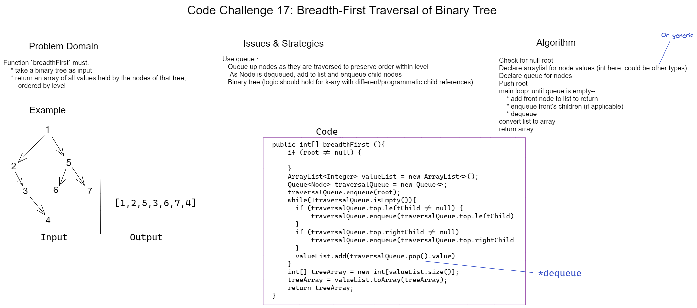

# Challenge 17 Whiteboard: Breadth-First Tree Traversal

Desired function `breadthFirst` must:

Return an array of every value held by the nodes in a binary tree in level order.

## Whiteboard Process

## Approach & Efficiency

My approach uses an iterative queue as means of traversal as well as an arraylist to hold traversed values. The queue allows for a First-In, First-Out ordering of nodes so that level order is maintained regardless of tree balance.

Time Efficiency: O(n)
* Every node must necessarily be traversed (via enqueueing).

Space Efficiency: O(log n)
* Other than the required array of values, a temporary queue must hold all nodes at some point. This queue will at most hold (width + 1) nodes concurrently, so will scale less than linearly with the size of the tree.
