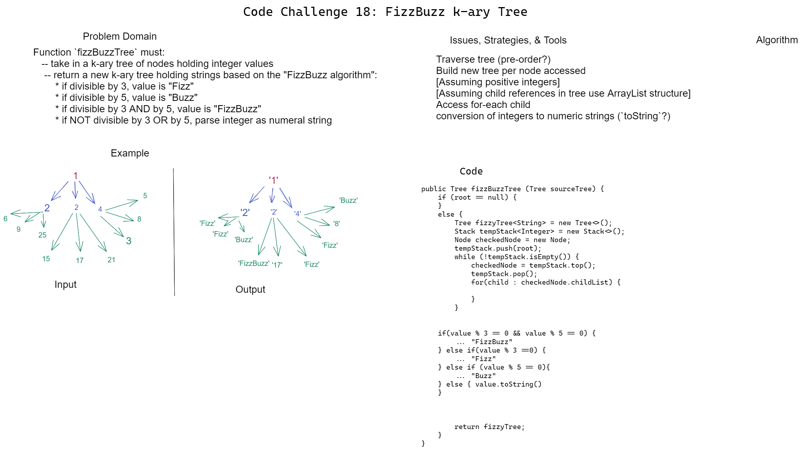

# Challenge 18 Whiteboard: FizzBuzz K-ary Tree

Desired function `fizzBuzzTree`` must:

Take in a tree of indeterminate children per level holding integer values;
Return a second tree with held string values corresponding to "Fizz", "Buzz", "FizzBuzz", or a string of the original integer value, depending on if the original value is divisible by 3, by 5, by both 3 and 5, or neither, respectively.

## Whiteboard Process

## Approach & Efficiency

My approach declares a temporary stack for

* Time Efficiency: O(n) every node must be traversed (and likewise FizzBuzz-checked and built), so efficiency will scale linearly with the size of the input tree.

* Space Efficiency:
