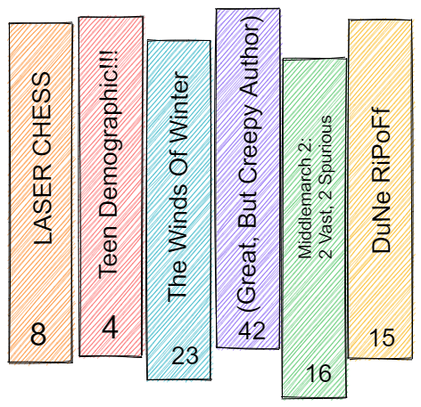
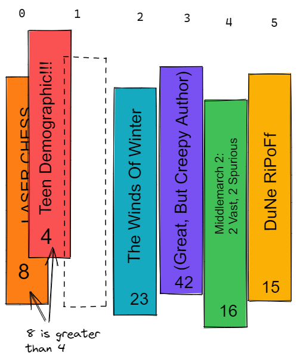

# Explained Simply: Insertion Sorting

If you're collecting something, you likely want it sorted somehow-- maybe alphabetically, by color, or by the Dewey Decimal system. In any of these cases, how do you handle new additions to your collection? When sorting a collection in Java, we have to consider  Let's look at the example of books on a library shelf using a simplified filing system like below:

We want to sort in ascending number code order, so a properly functioning sorting algorithm will end with the red book in the first index with "4" and the purple book in the final index as "42" (with the numbers increasing in between). In our code, it will help to have a temporary variable to store a value and compare with others. We can imagine our algorithm as our librarian picking up one book at a time from the shelf and comparing the printed numbers. Let's start with the first pair of books in this group, the orange one (8) and the red one (4):

The librarian picks up the book, then compares to the : Our librarian will have to repeat this process not only *for each book* (except the original last book, since it will have been compared to all of the others already), but for each book *against each book* until they are all sorted.  

This approach is simple to understand and to code, but has its limits. While a small shelf is managable, this method quickly falls apart as the size of the library scales. This process may take more or less time depending on how "messy" the original array is, but in the worst case almost every book will have to be compared to multiple books, with the earlier ones compared to almost *every* book (On^2). Even for the computerized librarian we're coding, other solutions will often be preferable.
