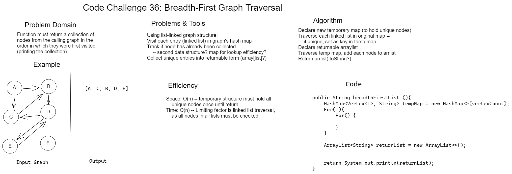
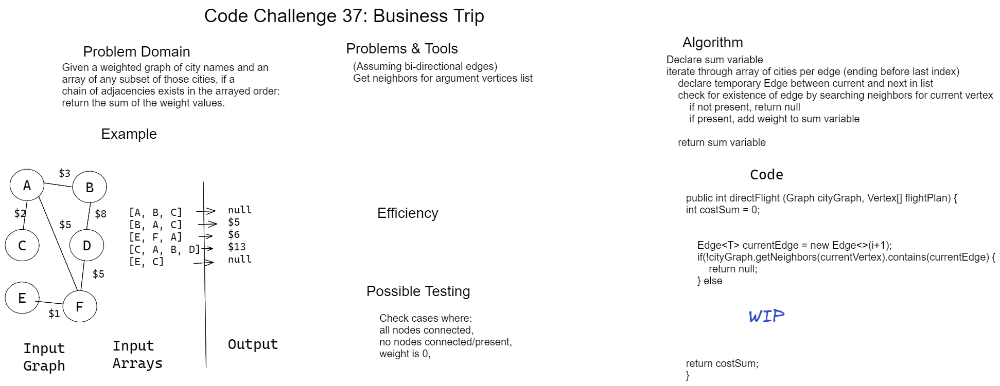

# Code Challenge 36 : Breadth-First Graph Traversal
Whiteboard attempted 04/04/22
This goal of this challenge was to write a function that would traverse a graph and return a list of every unique node visited.

## Whiteboard Image

## My Approach

My approach uses a temporary hash map to hold unique nodes found in the graph's map's linked lists -- unique status is determined by checking if the temporary map contains a given node before adding it (as this check is highly efficient). After the original map is fully iterated through, the temporary map is iterated through to access these values to prepare them for return as a collection of printed strings.

### Efficiency

* Space: O(n) -- all unique nodes must be held in a secondary hash map concurrently.

* Time: O(n) -- all nodes must be traversed in the original linked list (and in the temporary list before returning), but map lookup does not appreciably add time.

## Code

# Code Challenge 37 : Business Trip
Whiteboard attempted 04/05/22
This goal of this challenge was to write a function that would take a weighted graph and a list of vertices as input and return the summed weight of the listed path of vertices (if it exists.)

## Whiteboard Image

## My Approach

### Testing

Tests should account for cases where: all nodes are connected; no nodes are connected/present;

### Efficiency

* Space: O(1) -- Only a single summing variable is required to be returned, and called graph methods are for iteration rather than storage.

* Time: O(n) -- For n-1 pairs of listed vertices, the graph must be traversed to check for an edge (and its value). Nested lookup calls should be O(1).

## Code
